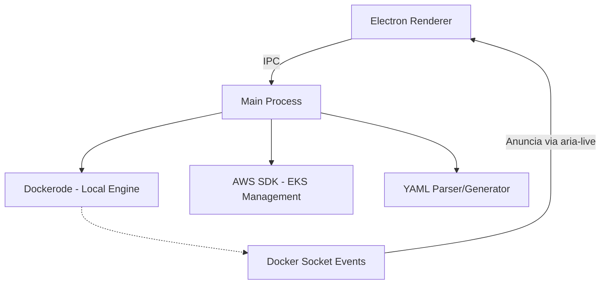

# Heitor CD (Electron)

Container Manager Desktop com foco em acessibilidade real para Docker e Kubernetes (EKS).
Orquestração, Compose e Cloud Management A11y-First.

## 1) Visão geral

O **Container Manager Desktop** é um cliente desktop em Electron para:

- Gerenciar containers locais.
- Criar e monitorar stacks Docker Compose.
- Evoluir para gestão de clusters AWS EKS.

## 2) Requisitos obrigatórios de acessibilidade (WCAG)

Este projeto segue **WCAG 2.2 nível AA** como requisito mínimo. Toda nova interface deve atender:

- **Perceptível:** labels claros, contraste adequado, feedback visual + textual.
- **Operável:** 100% das ações disponíveis por teclado, sem dependência de mouse.
- **Compreensível:** mensagens de erro objetivas e instruções de ação.
- **Robusto:** semântica consistente e compatibilidade com NVDA/JAWS.

### Regras técnicas obrigatórias

- Elementos interativos com nome acessível (`aria-label`, `aria-labelledby` ou texto visível).
- Hierarquia semântica consistente (`main`, `nav`, `table`, `dialog`, etc.).
- Gerenciamento de foco ao abrir/fechar modais e trocar de abas.
- Regiões ao vivo (`aria-live="polite"` e `aria-live="assertive"`) para status e erros.

## 3) Paridade mouse x teclado (inclui arrastar e soltar)

Qualquer funcionalidade feita com mouse **deve** ter fluxo equivalente por teclado.

### Exemplo obrigatório para drag-and-drop

- Entrar no modo mover item.
- Escolher destino com setas.
- Confirmar movimentação.
- Cancelar movimentação.

### Regras obrigatórias de seleção e contexto

- Selecionar/desmarcar `container`, `image` ou `network` usando `Space`.
- Abrir menu de contexto do item selecionado usando `Ctrl+Space`.
- Abrir a visualização em árvore de categorias usando `Ctrl+E`.

Sem esse fluxo de teclado, a funcionalidade não é considerada concluída.

## 4) Atalhos configuráveis via `.keymaps`

Todas as funções do app devem possuir um `actionId` e um atalho padrão no arquivo `.keymaps` (raiz do projeto).

- O app carrega `.keymaps` na inicialização.
- O usuário pode editar atalhos sem alterar código-fonte.
- Cada nova função deve ser registrada no README e no `.keymaps`.

### Atalhos padrão

| actionId | Atalho padrão | Função |
| --- | --- | --- |
| `app.goDashboard` | `Ctrl+1` | Ir para Dashboard |
| `app.goComposer` | `Ctrl+2` | Ir para Composer |
| `app.goStacks` | `Ctrl+3` | Ir para Stacks |
| `app.goImages` | `Ctrl+4` | Ir para Imagens |
| `app.goNetworks` | `Ctrl+5` | Ir para Redes |
| `app.goLogs` | `Alt+4` | Ir para tela de Logs |
| `app.goCloud` | `Ctrl+6` | Ir para Cloud (EKS) |
| `app.nextTab` | `Ctrl+Tab` | Avançar para a próxima aba (cíclico) |
| `app.prevTab` | `Ctrl+Shift+Tab` | Voltar para a aba anterior (cíclico) |
| `app.openCommandPalette` | `Ctrl+K` | Abrir paleta de comandos |
| `app.focusSearch` | `Ctrl+F` | Focar busca da tela atual |
| `app.refreshCurrentView` | `F5` | Atualizar dados da tela atual |
| `app.openKeymaps` | `Ctrl+Shift+K` | Abrir arquivo de atalhos |
| `app.toggleMonitoring` | `Ctrl+Alt+M` | Pausar/retomar monitoramento de eventos |
| `help.showShortcuts` | `Ctrl+/` | Exibir ajuda de atalhos |
| `selection.toggleItem` | `Space` | Selecionar/desmarcar item focado (container/image/network) |
| `item.openContextMenu` | `Ctrl+Space` | Abrir menu de contexto do item focado/selecionado |
| `navigation.openCategoryTree` | `Ctrl+E` | Abrir árvore de categorias da aba atual |
| `tree.previousNode` | `Up` | Navegar para item anterior da árvore |
| `tree.nextNode` | `Down` | Navegar para próximo item da árvore |
| `tree.expandNode` | `Right` | Expandir nó da árvore |
| `tree.collapseNode` | `Left` | Recolher nó da árvore |
| `tree.activateNode` | `Enter` | Ativar item selecionado na árvore |
| `composer.addService` | `Ctrl+Shift+A` | Adicionar serviço no Compose |
| `composer.moveServiceMode` | `Ctrl+Shift+M` | Entrar no modo mover serviço (equivalente ao drag-and-drop) |
| `composer.moveServiceUp` | `Alt+Up` | Mover serviço para cima |
| `composer.moveServiceDown` | `Alt+Down` | Mover serviço para baixo |
| `composer.confirmMove` | `Enter` | Confirmar movimento |
| `composer.cancelMove` | `Esc` | Cancelar movimento |
| `logs.copyStdErr` | `Ctrl+Shift+C` | Copiar apenas STDERR/logs de falha |
| `modal.close` | `Esc` | Fechar modal/dialog |
| `dashboard.toggleStoppedContainers` | `Ctrl+Alt+S` | Alternar visualização de containers parados |
| `app.increaseZoom` | `Ctrl+Plus` | Aumentar zoom (máximo 200%) |
| `app.decreaseZoom` | `Ctrl+Minus` | Diminuir zoom (mínimo 80%) |
| `app.resetZoom` | `Ctrl+0` | Resetar zoom para 100% |

## 5) Docker Compose e monitoramento

### Visual Builder

- Composição visual de serviços, redes e parâmetros.
- Exportação para `docker-compose.yaml`.
- Importação de `.yaml` existentes com feedback de status.

### Monitoramento local e eventos em tempo real

O app **monitora continuamente** o ambiente Docker local e atualiza a UI automaticamente:

- **Containers**: Criação, início, parada, remoção de containers (mesmo via terminal/CLI).
- **Imagens**: Download, pull e remoção de imagens.
- **Networks**: Criação, conexão de containers, remoção de networks.
- **Serviços Compose**: Mudanças de estado em stacks (via `docker compose up`, `down`, etc.).

A sincronização ocorre via listener de eventos Docker (Docker Events API) sem necessidade de polling.

- Cada evento dispara uma atualização na aba correspondente da UI.
- Regiões ao vivo (`aria-live="assertive"`) anunciam mudanças críticas (container iniciado, parado, erro).
- Sincronização com ações feitas na CLI (`docker compose up`, etc.) é automática.
- Atualização de saúde dos serviços em tempo real.
- Ao usar `Alt+4`, se houver um container em execução selecionado (ex.: Kafka), a tela de Logs abre já filtrada nesse container.

### Visualização em árvore por categoria

- Ao usar `Ctrl+E`, o foco vai para a árvore de itens da aba atual.
- Exemplo: na aba `Networks`, ao expandir uma network, são mostrados os nomes dos containers vinculados.
- A árvore mantém paridade de teclado com seleção por `Space` e menu de contexto por `Ctrl+Space`.

### Dashboard: Filtro de containers

- **Por padrão**, a aba Dashboard exibe apenas containers **em execução** (equivalente a `docker ps`).
- Um **toggle de filtro** (button com `enabled = false` por padrão) permite alternar para **mostrar todos os containers** (executando + parados), equivalente a `docker ps -a`.
- O estado do toggle persiste na sessão do usuário.
- Leitores de tela anunciam o estado atual do filtro via `aria-live="polite"`.

## 6) Roadmap

### Fase EKS (próximas versões)

- Troca de contexto entre Docker local e `kubectl` (EKS).
- Visualização de Pods, Deployments e Services.
- Integração de autenticação AWS.

## 7) Arquitetura técnica



## 8) Compatibilidade multiplataforma

O Container Manager Desktop funciona nativamente em:

- **Windows** (10+): Docker Desktop ou Docker via WSL2
- **macOS** (10.13+): Docker Desktop
- **Linux** (Ubuntu 18.04+, Fedora, Debian): Docker Engine

### Suporte do Docker no Windows

O app detecta e conecta automaticamente a:

1. **Docker Desktop** (recomendado): Socket em `\\.\pipe\docker_engine` (named pipe).
2. **Docker via WSL2**: Socket em `/mnt/wsl/shared-docker/docker.sock` (quando Docker está instalado e rodando dentro do WSL).

Na inicialização, o app tenta conectar em ambos os pontos; se um estiver disponível, é utilizado.

### Detecção de plataforma

- No **Windows**, o app detecta a presença de WSL2 e, se disponível, oferece opção visual de desabilitar/habilitar Docker Desktop entre contextos.
- No **macOS** e **Linux**, a conexão é direta via socket padrão (`/var/run/docker.sock`).

## 9) Arquitetura modular e estilos centralizados

### Estrutura de pastas

```
container-manager-desktop/
├── src/
│   ├── main/                    # Processo principal Electron
│   │   ├── main.ts
│   │   └── ipc/                 # Handlers IPC
│   │
│   ├── renderer/                # Processo renderer (UI)
│   │   ├── index.html
│   │   ├── App.tsx              # Componente raiz
│   │   ├── pages/               # Páginas/abas principais
│   │   │   ├── Dashboard.tsx
│   │   │   ├── Composer.tsx
│   │   │   ├── Stacks.tsx
│   │   │   ├── ImagesNetworks.tsx
│   │   │   ├── Logs.tsx
│   │   │   └── Cloud.tsx
│   │   │
│   │   ├── components/          # Componentes reutilizáveis
│   │   │   ├── Button/
│   │   │   ├── Input/
│   │   │   ├── Toggle/
│   │   │   ├── Modal/
│   │   │   ├── Tree/            # Componente de árvore
│   │   │   ├── List/
│   │   │   ├── Table/
│   │   │   └── StatusBadge/
│   │   │
│   │   ├── styles/              # Theme e estilos centralizados
│   │   │   ├── theme.ts         # Definições de cores, tipografia
│   │   │   ├── global.css       # Estilos globais + reset
│   │   │   ├── variables.css    # CSS Variables (alto contraste)
│   │   │   └── accessibility.css # Regras WCAG
│   │   │
│   │   ├── hooks/               # React hooks customizados
│   │   │   ├── useKeyboardNav.ts
│   │   │   ├── useZoom.ts
│   │   │   ├── useFocusManagement.ts
│   │   │   └── useTheme.ts
│   │   │
│   │   ├── services/            # Integrações e utilitários
│   │   │   ├── dockerService.ts
│   │   │   ├── keymapsService.ts
│   │   │   ├── themeService.ts
│   │   │   └── eventBusService.ts
│   │   │
│   │   └── utils/               # Funções auxiliares
│   │       ├── aria.ts          # Helpers para acessibilidade
│   │       ├── focus.ts         # Gerenciamento de foco
│   │       └── keyboard.ts      # Utilidades de teclado
│   │
│   ├── types/                   # Tipos TypeScript compartilhados
│   │   └── docker.ts
│   │
│   └── assets/                  # Imagens, ícones
│
├── .keymaps                     # Atalhos configuráveis
├── package.json
└── tsconfig.json
```

### Tema e alto contraste

**Cores padrão** (tema escuro com alto contraste):

- Background: `#000000` (preto puro)
- Foreground: `#FFFFFF` (branco puro)
- Accent: `#00FF00` (verde lime para destaques)
- Borders: `#888888` (cinza médio)
- Erros: `#FF0000` (vermelho puro)
- Avisos: `#FFFF00` (amarelo puro)
- Sucesso: `#00FF00` (verde puro)

Todas as cores usam `CSS Variables` para fácil customização.

### Suporte a zoom e ampliação de fontes

- `Ctrl+Plus` / `Ctrl+Shift+Plus`: Aumentar zoom (máximo 200%)
- `Ctrl+Minus` / `Ctrl+Shift+Minus`: Diminuir zoom (mínimo 80%)
- `Ctrl+0`: Resetar zoom para 100%

O zoom é aplicado globalmente via `document.body.style.transform: scale()`; fontes, ícones e hitAreas escalam proporcionalmente.

- O nível de zoom persiste na sessão do usuário.
- Regiões com `overflow: auto` escrolam corretamente com zoom ativo.

### Componentes centralizados

Todos os componentes (Button, Input, Toggle, Modal, Tree, etc.) importam styles do `styles/theme.ts` e `styles/variables.css`:

- Estilos únicos e consistentes.
- Fácil de manter e evoluir.
- Acessibilidade garantida por padrão (`aria-label`, role atributivos, etc.).

## 10) Como executar (desenvolvimento)

1. Clone o repositório.
2. Instale dependências: `npm install`.
3. Inicie o app: `npm start`.
4. Garanta que o Docker esteja ativo e acessível.
